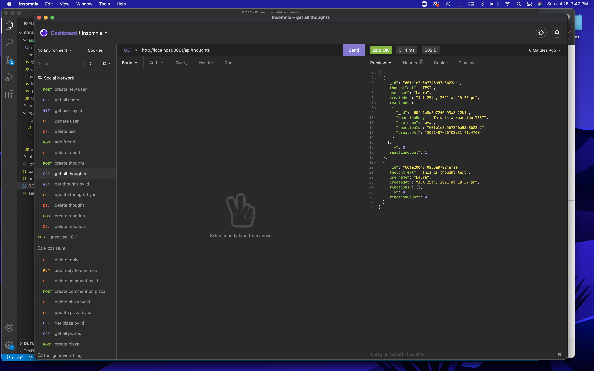
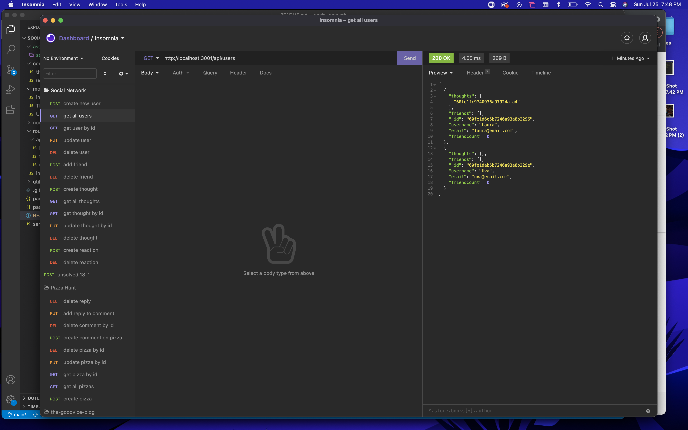

# Social-Network

## Summary: 
> The back end for a social network application, which would allow for the creation of users, users' thoughts and reactions to thoughts. 

## Table of Contents
* [Installation](#Installation)
* [Usage](#Usage)
* [Demo](#Demo)
* [Screenshots](#Screenshots)
* [Technologies](#Technologies)
* [Questions](#Questions)

## Installation:
To install the application clone the repository and run `npm i` in the command line to install dependencies.

## Usage:
* Once repo is cloned locally, run `npm start` in the command line to start the application.
* Then all API routes can be tested using an API client such as Insomnia.

## Demo:

Link to full video: https://drive.google.com/file/d/1eLvZQqanox_PAltazaBH77MVULXIWuE9/view

## Screenshots:

## Technologies:
+ Express.js
+ Node.js
+ MongoDB
+ Mongoose

## Questions:
GitHub: [crossigarcia](https://github.com/crossigarcia) 

For additional information on this project you can email your questions here: <cecilia.rossi.garcia@gmail.com>  